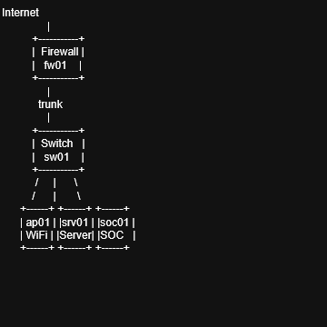
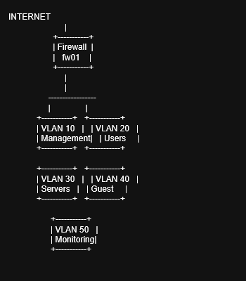
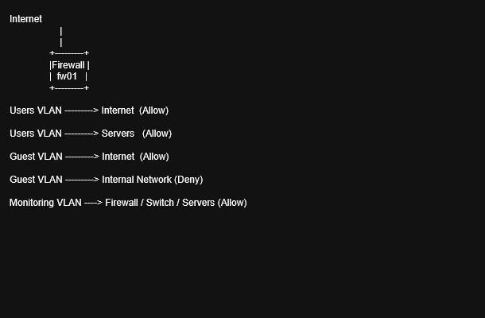

# Enterprise Security Lab

This project documents a simulated enterprise network environment designed to demonstrate network architecture, segmentation, firewall policy control, and monitoring visibility.

The lab focuses on practical network engineering and security concepts such as VLAN segmentation, controlled inter-VLAN communication, centralized firewall enforcement, and operational monitoring.

---

## Network Architecture

The Enterprise Security Lab simulates a segmented enterprise network where traffic between zones is controlled by a firewall and monitored through centralized logging and monitoring systems.

### Topology Diagram



---

## VLAN Segmentation

The environment uses VLAN-based segmentation to separate different network roles and trust levels.

| VLAN | Network Role |
|-----|--------------|
| VLAN 10 | Management |
| VLAN 20 | Users |
| VLAN 30 | Servers |
| VLAN 40 | Guest |
| VLAN 50 | Monitoring |

### Segmentation Diagram



This segmentation model enforces clear trust boundaries and limits unnecessary communication between network zones.

---

## Traffic Flow Model

The firewall controls communication between VLANs and external networks.

### Traffic Flow Diagram



Example communication rules:

- Users VLAN → Internet (Allowed)
- Users VLAN → Servers (Allowed)
- Guest VLAN → Internet (Allowed)
- Guest VLAN → Internal Network (Denied)
- Monitoring VLAN → Infrastructure Devices (Allowed)

This model prevents lateral movement and enforces a least-privilege communication design.

---

## Infrastructure Components

The lab environment includes several core infrastructure devices.

### Firewall (fw01)

The firewall acts as the central security control point in the network.

Responsibilities include:

- inter-VLAN routing  
- firewall policy enforcement  
- network segmentation  
- NAT for internet connectivity  
- logging and security visibility  

---

### Managed Switch (sw01)

The switch provides the Layer 2 infrastructure for the network.

Responsibilities include:

- VLAN segmentation  
- trunk connections to firewall  
- access ports for endpoints  
- infrastructure connectivity  

---

### Wireless Access Point (ap01)

The wireless access point provides network access for wireless devices.

Responsibilities include:

- wireless connectivity  
- SSID mapping to VLANs  
- separation of user and guest networks  

---

### Infrastructure Server (srv01)

Servers host internal services used by the environment.

Examples include:

- DNS  
- DHCP  
- application services  
- internal infrastructure tools  

---

### Monitoring System (soc01)

The monitoring platform provides visibility into network operations and security events.

Examples include:

- syslog collection  
- SNMP monitoring  
- dashboard visualization  
- security event analysis  

---

## Monitoring and Visibility

The monitoring layer collects operational and security data from network devices and servers.

Examples of monitoring sources include:

- firewall logs  
- switch status and SNMP metrics  
- server system logs  
- authentication events  
- network traffic patterns  

Monitoring improves incident detection, troubleshooting capability, and operational awareness.

---

## Documentation Structure

The project contains structured documentation covering network design and operations.

```
docs/
│
├ 01-overview.md
├ 02-architecture.md
├ 03-topology.md
├ 04-ip-addressing.md
├ 05-vlan-design.md
├ 06-network-flows.md
├ 07-security-model.md
├ 08-firewall-policies.md
├ 09-devices.md
├ 10-services.md
├ 11-operations.md
├ 12-incident-response.md
├ 13-controls-mapping.md
├ 14-diagram-standards.md
```

---

## Project Structure

```
enterprise-security-lab
│
├ README.md
│
├ docs
│
├ diagrams-src
│   ├ topology.drawio
│   ├ vlan-segmentation.drawio
│   └ traffic-flow.drawio
│
├ assets
│   └ images
│       ├ topology.png
│       ├ vlan-segmentation.png
│       └ traffic-flow.png
```

- **docs/** contains architecture and operational documentation  
- **diagrams-src/** contains editable diagram source files  
- **assets/images/** contains exported diagram images used in documentation  

---

## Diagram Standards

Diagram conventions and documentation guidelines are defined in:

docs/14-diagram-standards.md

This document ensures diagrams follow consistent layout, naming, and visual conventions.

---

## Purpose of the Lab

This lab is designed to demonstrate practical network engineering and security architecture skills including:

- enterprise network segmentation  
- firewall-based security control  
- infrastructure documentation  
- monitoring and operational visibility  
- incident response readiness  

The project serves as both a technical learning environment and a structured network architecture documentation example.

---

## Future Improvements

Potential future enhancements include:

- additional network diagrams  
- advanced firewall rule documentation  
- security zone visualization  
- monitoring dashboards  
- infrastructure automation examples  

---

## Author

Enterprise network and security lab documentation project focused on infrastructure design and operational best practices.