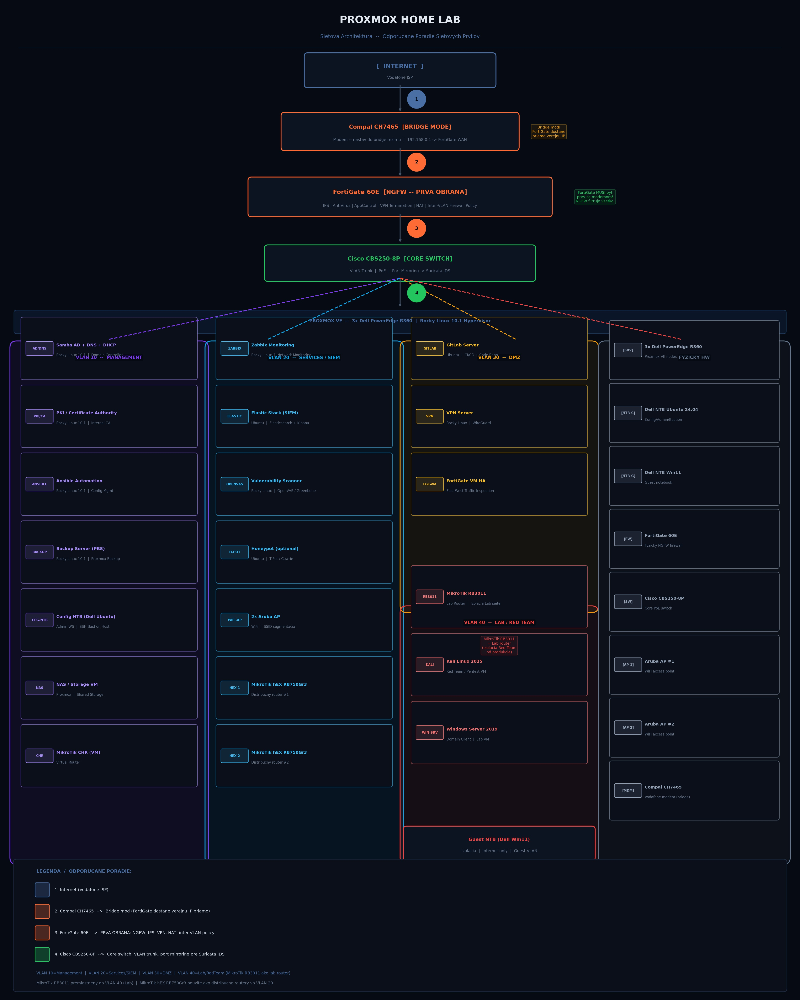

# Enterprise Security Lab

Enterprise-style **Network Security Lab** demonstrating firewall architecture, VLAN segmentation and security design principles.

---

# Live Lab Portal

Interactive documentation portal:

https://pelen171004-wq.github.io/enterprise-security-lab/

Contains:

- Architecture diagrams
- Device configuration documentation
- Security design decisions
- Threat model
- Troubleshooting playbooks

---

# Network Architecture

### Network Security Zones

| Zone | Description |
|-----|-------------|
| Internet | Untrusted external network |
| Firewall | Security enforcement point (FortiGate) |
| Users VLAN | Standard internal client network |
| Guest VLAN | Isolated internet-only network |
| Management VLAN | Administrative access to network devices |
| Server Zone (planned) | Infrastructure services |
| Backup Zone (planned) | Backup infrastructure and storage |

Core components:

| Component | Role |
|--------|------|
| FortiGate 60E | Network firewall / security enforcement |
| Cisco CBS250 | Layer2 switching / VLAN segmentation |
| VLAN Zones | Security segmentation |
| Firewall Policies | Inter-VLAN access control |

---

# Skills Demonstrated

This project demonstrates practical skills in:

- Network segmentation
- Firewall policy architecture
- Infrastructure security design
- Network troubleshooting
- Security monitoring design
- Architecture documentation
- Threat modeling
- Security frameworks alignment

---

# Security Architecture

Key security design elements implemented in this lab:

- VLAN-based network segmentation
- Inter-VLAN firewall policy enforcement
- Guest network isolation
- Management plane protection
- Zero Trust inspired architecture
- Explicit allow/deny firewall model
- Default-deny mindset

---

# Security Controls Implemented

| Security Control | Implementation |
|------------------|---------------|
| Network Segmentation | VLAN architecture on Cisco CBS250 |
| Firewall Enforcement | FortiGate NGFW policies |
| Guest Isolation | Dedicated VLAN with internet-only access |
| Management Plane Protection | MGMT VLAN with restricted access |
| Inter-VLAN Security | Firewall policy model |
| Threat Modeling | Documented attack surface and threats |
| Architecture Governance | Architecture Decision Records (ADR) |
| Security Framework Alignment | Zero Trust + CIS Controls |

# Attack Surface Overview

The lab identifies potential attack vectors and security mitigations.

| Attack Surface | Threat | Mitigation |
|---------------|-------|-----------|
| Internet Edge | Port scanning | Firewall policy enforcement |
| Guest Network | Untrusted device | VLAN isolation |
| User Network | Compromised endpoint | Inter-VLAN firewall rules |
| Management Plane | Unauthorized access | MGMT VLAN + restricted access |

Full documentation:

- Attack Surface Portal  
https://pelen171004-wq.github.io/enterprise-security-lab/attack-surface.html

---

# Security Framework Alignment

Architecture decisions portal:

https://pelen171004-wq.github.io/enterprise-security-lab/architecture-decisions.html

---

# Threat Model

Threat modeling identifies potential attack scenarios.

Documentation:

- [Network Zone Threat Model](threat-model/THREAT-001-network-zones.md)

---

# Troubleshooting & Operations

The project includes operational troubleshooting documentation.

Examples:

- connectivity debugging
- firewall policy validation
- network diagnostics

Troubleshooting playbook:

https://pelen171004-wq.github.io/enterprise-security-lab/troubleshooting.html

---

# Lab Roadmap

Planned improvements.

## Phase 1 – Core Network Security (Current)

- FortiGate NGFW deployment
- Cisco CBS250 switching
- VLAN segmentation
- Guest network isolation
- Management VLAN
- Inter-VLAN firewall policy model

## Phase 2 – Security Monitoring

- SOC VLAN deployment
- Log collection
- SIEM integration
- Network traffic monitoring

## Phase 3 – Infrastructure Expansion

- Server zone deployment
- Backup infrastructure zone
- Security service segmentation

## Phase 4 – Enterprise Features

- Firewall High Availability (HA)
- Configuration backup automation
- Security incident response runbooks

The security design aligns with industry frameworks:

- [Zero Trust Networking Model](security-frameworks/zero-trust-model.md)
- [CIS Network Security Controls](security-frameworks/cis-network-controls.md)

---

# Architecture Decision Records (ADR)

Architecture decisions explain **why the network was designed this way**.

Examples:

- Network segmentation model
- Firewall policy architecture
- Management plane protection

Documentation:

architecture-decisions/Architecture decisions portal:

https://pelen171004-wq.github.io/enterprise-security-lab/architecture-decisions.html